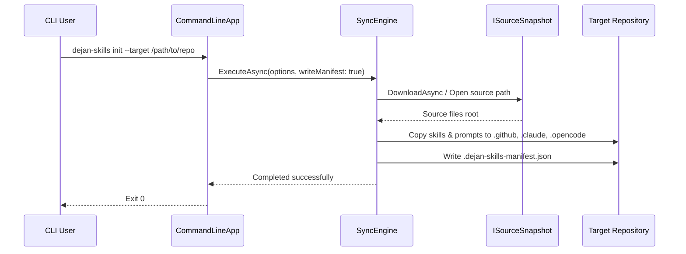

# Sync Tool Architecture

The `Dejan.Skills.Tool` project (published as the global command-line tool `dejan-skills`) provides robust synchronization of reusable AI assistant skills and prompts from a central repository into downstream repositories across multiple tool ecosystems.

## Core Components

The application is structured around a modular .NET console architecture in `/src/Dejan.Skills.Tool`:

1. **`Program.cs` & `CommandLineApp`**: Parses command-line arguments (`list`, `init`, `bootstrap`, `update`, `tools`) and handles exceptions.
2. **`SyncEngine.cs`**: Manages snapshot loading, content catalog discovery, platform selection (`.github`, `.claude`, `.opencode`), file copying, and `.dejan-skills-manifest.json` generation.
3. **`ToolsEngine.cs`**: Handles auxiliary repository setup tasks, git hooks, cross-platform `.gitignore` rules, and graphify integration.
4. **Source Snapshots (`ISourceSnapshot`)**: Supports both `LocalSourceSnapshot` (for local development and testing) and `GitHubArchiveSnapshot` (fetching tarballs from GitHub releases or branches).

## Supported Ecosystems & Platforms

`SyncEngine` maps canonical source folders to platform-specific layouts:

- **GitHub Copilot**: `.github/skills/`, `.github/prompts/`
- **Claude**: `.claude/skills/`, `.claude/prompts/` (or mapped prompt paths)
- **OpenCode**: `.opencode/skills/`, `.opencode/prompts/`

Related documentation: see [/openwiki/domain/skills-and-prompts.md](/openwiki/domain/skills-and-prompts.md) for details on specific skill assets.
