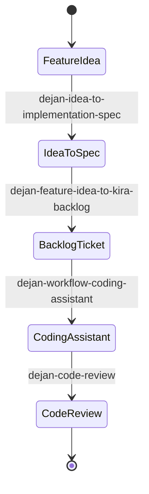

# Skills and Prompts Catalog

The repository defines a rich set of engineering workflows codified as reusable AI assistant skills and dot-prefixed prompt aliases. These assets are consumed by AI coding assistants (`GitHub Copilot`, `Claude`, and `OpenCode`) to enforce consistent review standards, ticket management, and architecture practices.

## Major Skill Domains

1. **Code Review & Quality**:
   - `dejan-code-review` and `agent-code-review`: Enforce rigorous code quality standards, security checks, and automated reviews before merging.
   - `dejan-prepare-code-review`: Prepares pull requests and review packets.
2. **Coding Assistants & Workflows**:
   - `dejan-workflow-coding-assistant` and `agent-coding-assistant`: Guided coding workflows from specification to implementation.
   - `dejan-writer-assistant`: Documentation and writing assistance.
3. **Ticket Operations & Backlog Management**:
   - `dejan-kira-mcp-ticket-ops`: MCP-powered integration for creating and updating tickets in Kira.
   - `dejan-feature-idea-to-kira-backlog`: Decomposes feature ideas into implementation specs and structured backlog tickets.
   - `dejan-idea-to-implementation-spec`: Translates high-level ideas into detailed engineering specs.

## Prompt Aliases

Prompt aliases under `.github/prompts/` (such as `dejan.code-review.prompt.md`, `dejan.kira-mcp-ticket-ops.prompt.md`, and `dejan.writer-assistant.prompt.md`) serve as direct entrypoints in chat interfaces, invoking the corresponding skills and reference checklists.

Related architecture: see [/openwiki/architecture/sync-tool.md](/openwiki/architecture/sync-tool.md) for how these files are synchronized to downstream repositories.
