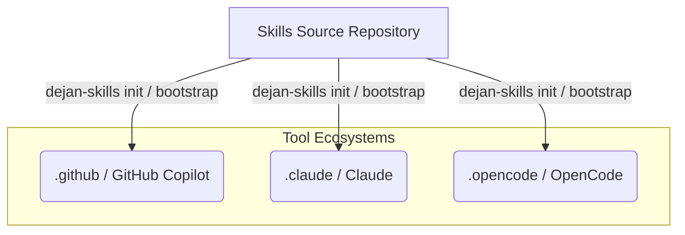

# Quickstart

Welcome to **skills**, a repository containing reusable Copilot/AI assistant skills, dot-prefixed prompt aliases, and `dejan-skills`, a packable .NET tool designed to sync these capabilities across target repositories and tool ecosystems (`.github`, `.claude`, `.opencode`).

## What is in this repository?

- **Reusable Skills**: Standardized workflow definitions and references under `.github/skills/` (and mirrored into `.claude/skills/` and `.opencode/skills/`).
- **Prompt Aliases**: Dot-prefixed prompt files under `.github/prompts/` exposing operational workflows in chat.
- **Sync Tool (`Dejan.Skills.Tool`)**: A command-line utility packaged as `dejan-skills` that lists, initializes, bootstraps, updates, and configures cross-platform tools across git repositories.

## Navigation

- Architecture: [/openwiki/architecture/sync-tool.md](/openwiki/architecture/sync-tool.md) — Explains the core .NET sync engine, snapshots, manifest tracking, and tool setup workflows.
- Domain Concepts: [/openwiki/domain/skills-and-prompts.md](/openwiki/domain/skills-and-prompts.md) — Details the catalog of reusable skills, prompt aliases, and Kira integration workflows.

## Backlog

- **Automated Registry Publishing**: Further automation around NuGet package publishing and multi-target versioning.
- **Extended Test Coverage**: Unit test suites for snapshot resolution and platform file transformations.
