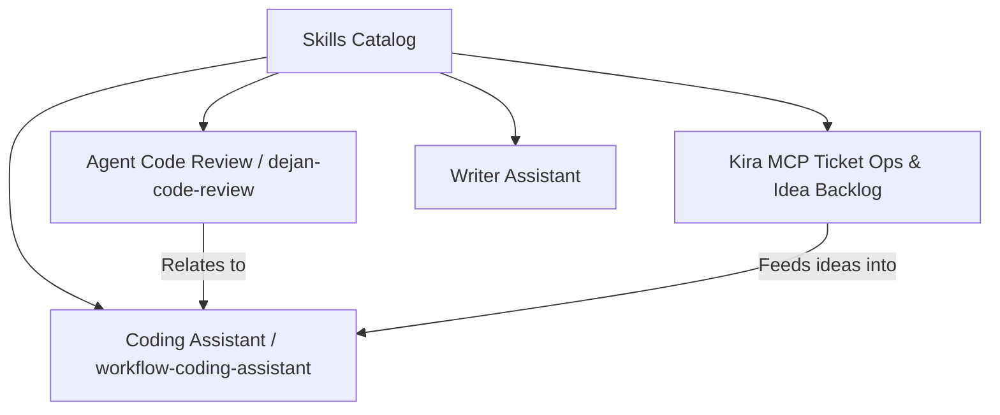

# Skills Catalog

This repository hosts a curated collection of specialized AI assistant skills and dot-prefixed prompt aliases. These skills provide structured workflows, code review heuristics, and ticket operations.

## Available Skills & Prompts

### Core Skills

- **`agent-code-review` / `dejan-code-review`**: Standardized code review checklist, KIRA comment requirements, and strict implementation boundaries.
- **`dejan-workflow-coding-assistant`**: Main conversational assistant guiding feature implementation, refactoring, and test verification.
- **`dejan-feature-idea-to-kira-backlog`**: Translates unstructured feature ideas into structured discovery questions, specs, and Jira/Kira tickets using bundled templates (`discovery-questions.md`, `ticket-decomposition-template.md`).
- **`dejan-kira-mcp-ticket-ops`**: Interacts with Kira/Jira MCP servers to fetch, update, and manage engineering tickets.
- **`dejan-idea-to-implementation-spec`**: Generates precise implementation specs and execution checklists from high-level product ideas.
- **`dejan-writer-assistant`**: Specialized assistance for technical writing, documentation structuring, and release notes.

## Synchronization

All skills are automatically mirrored or synced across target directories (`.github/skills`, `.claude/skills`, `.opencode/skills`) using the [.NET CLI Tool (`dejan-skills`)](/openwiki/tools/dejan-skills.md). Learn more about deployment pipelines in [Workflows & CI/CD](/openwiki/workflows/sync-and-ci.md).
