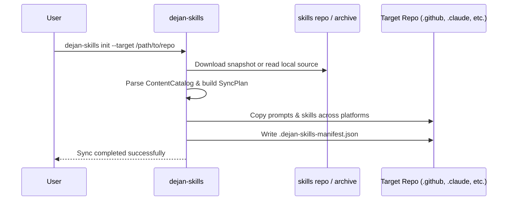

# Dejan Skills CLI Tool

The `dejan-skills` tool is a packable .NET 8/9 console application located under `src/Dejan.Skills.Tool/`. It enables developers and maintainers to sync prompts and skills from this repository into any git repository.

## Command Lifecycle



## Available Commands

- `dejan-skills list`: Displays available skills, prompts, and tool bundles from the source repository.
- `dejan-skills bootstrap`: Sets up prompt-first repository scaffolding.
- `dejan-skills init`: Synchronizes all configured prompts and skills to `.github`, `.claude`, and `.opencode` targets.
- `dejan-skills update`: Updates managed files based on an existing manifest.
- `dejan-skills tools`: Executes cross-platform setup scripts, git hooks, and `.gitignore` merges (e.g., `graphify-openwiki`).

## Installation & Usage

Install globally from NuGet:

```bash
dotnet tool install --global dejan-skills
```

Or sync directly against a target repository:

```bash
dejan-skills init --target /path/to/your/repo
```

For automated CI/CD synchronization and publishing details, see [Workflows & CI/CD](/openwiki/workflows/sync-and-ci.md).
