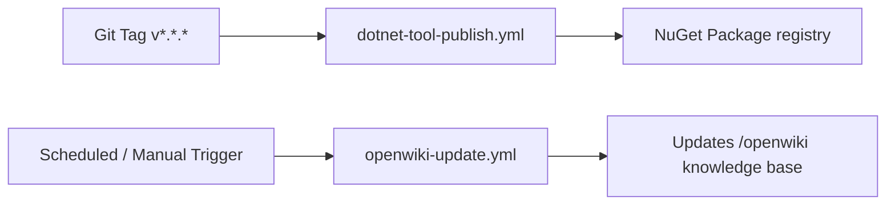

# Workflows & CI/CD

This repository utilizes GitHub Actions to automate NuGet package publishing, tool distribution, and OpenWiki knowledge base updates.

## CI/CD Pipeline Architecture

## Key Workflows

1. **NuGet Tool Publish (`dotnet-tool-publish.yml`)**:
   - Triggers on tag pushes (e.g., `v0.1.1`).
   - Builds the `.NET` project (`src/Dejan.Skills.Tool`), packages it into `nupkg/`, and publishes to NuGet.org.
2. **OpenWiki Update (`openwiki-update.yml`)**:
   - Automatically maintains and updates the OpenWiki knowledge base under `/openwiki`.
3. **Cross-Platform Tool Setup (`.github/tools/graphify-openwiki/`)**:
   - Provides setup scripts (`setup.sh`), post-commit hooks (`post-commit.sh`), and `.gitignore` integration templates for graphify and OpenWiki tools.

## Related Resources

- Learn about tool commands in the [Dejan Skills Tool Guide](/openwiki/tools/dejan-skills.md).
- Review architecture layouts in [Architecture Overview](/openwiki/architecture/overview.md).
- Return to the [Quickstart Overview](/openwiki/quickstart.md).
